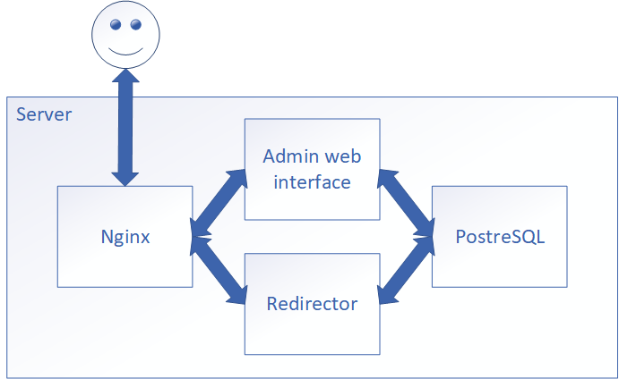

# test_shortner
Contacts: https://t.me/Kroning https://www.linkedin.com/in/alexander-bulakhov-3122aa62/  

The best way to learn is experimenting. 
I am trying to build shortner (or something alike) with 2 services (admin, redirect). 
It's not a good idea, but for learning purpose I decided to make 2 services at 1 repo: webinterface + redirector. In production it's better to place services in different modules to deploy easily on different servers.

If you can point something that I am doing wrong - feel free to write.

TODO:
1. HTML is simple. Better way - some API calls with JSON in return.
2. Routing module (because I can).
3. How to install (sql, nginx, rc.d)
4. Authorization and private links.
5. Link's statistic.

If there any better way to pass db handler to httpHandler? (Except main -> App struct -> Page struct)

Tried already: 
Modules & packages 
Project Layout 
net/http, basic routing, handlers 
Struct embedding 
Html/template basics 
Docs (commented, read with m=all) 
Configs (yml & env) 
Logging (log package, saving to file) 
Error handling (basic, added where it needs to return error) 
Tests (just a little, not 100% coverage; testify, require, assert)
Database (pgxpool)

v.1.0.*  

