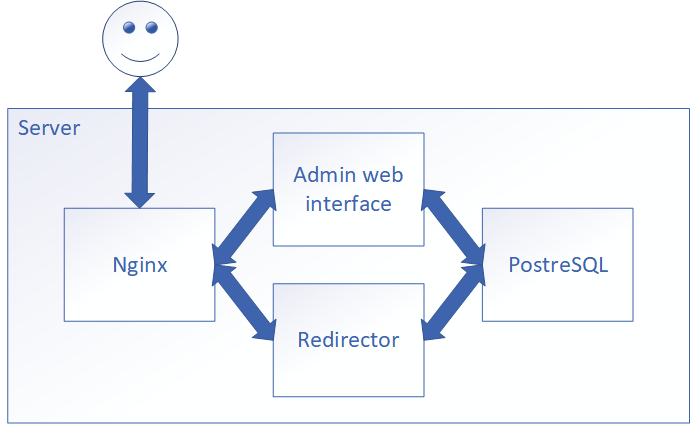

https://github.com/Kroning/test_shortner/releases/tag/v1.0.3 <br>
In this version everything is placed on 1 server: nginx + app(2 services) + postgresql database. Many things (like complete unit-tests) unfinished.

1. **Nginx** Add to your nginx.conf or use sites-enabled directory:
```
    server {
      listen       80;
      server_name  go.kroning.ru;
        charset utf-8;
        access_log  /usr/local/somedomain/logs/nginx.access.log; # Path to your error logs of nginx

        location /static {
          root /usr/local/somedomain/www; # Path to domain directory /usr/local/somedomain/www/static - is where static placed
        }

        location / {
            proxy_pass http://127.0.0.1:9990/;
            proxy_set_header    X-Real-IP   $remote_addr;
            proxy_set_header    X-Host      $http_host;
            proxy_set_header    X-Forwarded-For  $proxy_add_x_forwarded_for;
            proxy_set_header Range "";
            proxy_set_header Request-Range "";

        }
    }

    server {
      listen       80;
      server_name  redirect.kroning.ru;
        charset utf-8;
        access_log  /usr/local/somedomain/logs/redirect.access.log; # Path to your error logs of nginx

        location /static {
          root /usr/local/somedomain/www; # Path to domain directory /usr/local/somedomain/www/static - is where static placed
        }

        location / {
            proxy_pass http://127.0.0.1:9991/;
            proxy_set_header    X-Real-IP   $remote_addr;
            proxy_set_header    X-Host      $http_host;
            proxy_set_header    X-Forwarded-For  $proxy_add_x_forwarded_for;
            proxy_set_header Range "";
            proxy_set_header Request-Range "";

        }
    }
```
2. Make changes in **database**. Creation of user and table described at install/shortner1.0.0-.sql .
3. Copy configs and replace with your data
```
cp configs/shared_example.yml configs/shared.yml
cp configs/admin_example.yml configs/admin.yml
cp configs/redirect_example.yml configs/redirect.yml
```
4. **Build** app at working directory
```
go build -o main cmd/main.go
```
5. **Run** app any way you like. For example, you can run it from console:<br>
Quiting with ctrl+c:<br>
``` ./main -app admin ```<br>
Run at background<br>
``` ./main -app redirect & ```<br>
Or both<br>
``` ./main -app redirect & ./main -app admin & ```<br>



